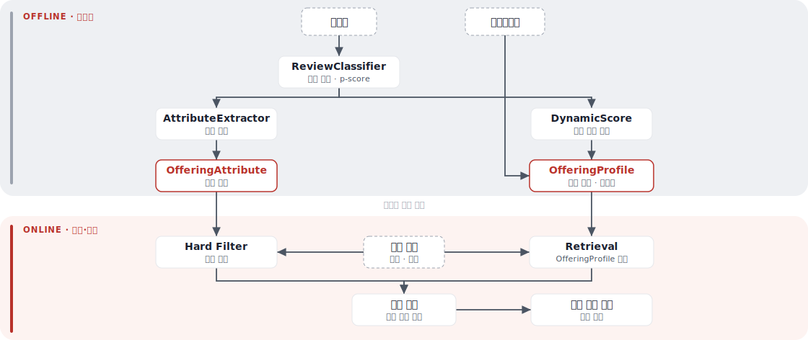
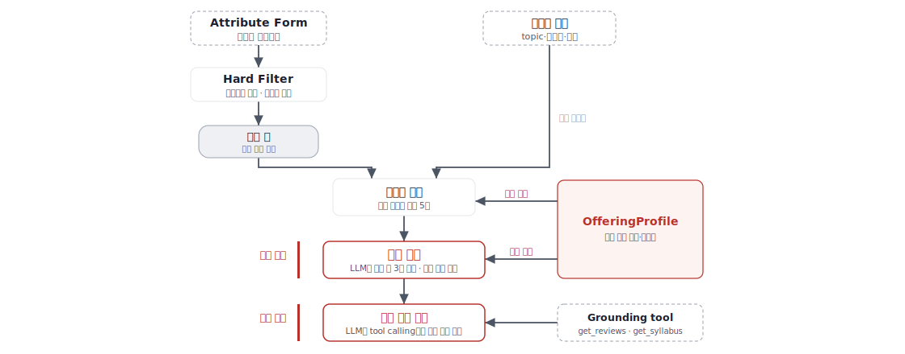

# 비정형 강의 정보 기반 수강 추천 에이전트

강의 소스(과목 설명·강의계획서·강의평)에서 추천 판단 근거를 구조화하고, 근거와 함께 현재 개설 강좌를 추천하는 수강 추천 시스템

- 서비스: [coursehub.kro.kr](https://coursehub.kro.kr)

## 구조

```text
backend/    FastAPI + SQLModel + PostgreSQL(pgvector) + openai SDK
frontend/   Vite + React 19 + TypeScript + react-router 7 + TanStack Query + Zustand
```

### backend/src/sourcealignrec/

| 폴더 | 역할 |
|------|------|
| `offline/ingestion/` | 강의평·강의계획서 DB 적재 |
| `offline/classifier/` | ReviewClassifier — BERT 기반 리뷰 타입 분류 학습·추론 |
| `offline/extractor/` | AttributeExtractor — 리뷰 속성 추출 학습·추출 파이프라인 |
| `offline/selector/` | DynamicScore 알고리즘 — 대표 리뷰 선정 + 리뷰 임베딩 |
| `offline/profiler/` | Offering/Professor Profile 생성 + 임베딩 |
| `offline/eval/` | eval split 기반 모델 성능 측정 |
| `online/filter.py` | Hard Filter (속성 조건 + 수강 이력 제외) |
| `online/systems/` | 추천 시스템 — Profile 검색 기반 추천(system_d) + tool grounding 대화(system_e) |
| `online/mcp/` + `api/mcp_server.py` | ChatKHU 연동용 MCP 도구 6종 |
| `api/` | HTTP API 라우터 (추천·검색·인증·위시리스트·시간표 등) |
| `db/models.py` | 전체 DB 스키마 (SQLModel) |

오프라인 파이프라인 실행 순서와 CLI 전체 목록은 `backend/pyproject.toml`의 `[project.scripts]` 참조.

## 시스템 아키텍처

강의계획서 + 강의평을 구조화해 두고(Offline), 사용자 요청 시 필터링·유사도 검색·LLM 추천을 수행(Online)하는 구조. 엣지케이스 처리와 맥락 유지는 LLM의 추론 능력에 위임하고, 알고리즘 기반 점수 합산은 최소화한다.



### Offline Pipeline — 강의 소스 구조화

과목 데이터가 추가·변경될 때 실행. 결과는 DB에 저장.

**ReviewClassifier** — `skt/A.X-Encoder-base` 기반 BERT fine-tuning multi-label 분류. 각 리뷰에 7개 타입(`grading` / `exam` / `assignment` / `attendance` / `teaching` / `topic` / `professor`) 레이블과 p-score를 부여하고, 어떤 타입에도 해당하지 않는 리뷰는 Noise로 필터링한다.

**AttributeExtractor** — 분류기 p-score 기준으로 per-review 스코핑하여 Hard Filter용 구조화 속성을 추출한다 (단일 encoder + 4-head BERT). 분류기가 이미 "이 리뷰에 grading 내용이 있다"를 판단했으므로 추출기는 값 결정에만 집중해 FP를 억제한다. 리뷰 단위 추출 결과를 Course+Professor 기준 다수결로 집계한다.

| Attribute | 소스 | 값 |
|---|---|---|
| `grading_leniency` | `grading` 리뷰 | 너그러움 / 깐깐함 |
| `assignment_load` | `assignment` 리뷰 | 많음 / 적음 |
| `team_project` | `assignment` 리뷰 | 있음 / 없음 |
| `attendance_strictness` | `attendance` 리뷰 | 엄격함 / 너그러움 |
| `exam_weight` | 강의계획서 | 높음 / 보통 / 낮음 |

**대표 리뷰 선정 (DynamicScore)** — 타입 커버리지 기반 greedy selection. 임베딩 MMR 대신 타입 커버리지를 다양성의 직접 proxy로 사용한다.

$$\text{DynamicScore}(r) = \left(\sum_{i \notin S_{\text{covered}}} P_i(r) + \lambda \sum_{i \in S_{\text{covered}}} P_i(r)\right) \times \text{Density}(r)$$

- $P_i(r)$: 타입 $i$에 대한 분류기 p-score, $S_{\text{covered}}$: 이미 선정된 리뷰들이 커버한 타입 집합, $\lambda < 1$: 커버된 타입의 기여 감쇄 (새 타입 커버에 인센티브)
- $\text{Density}(r)$: Gaussian KDE 기반 여론 대표성 — 주변 리뷰들과의 의미 유사도 평균. 내용이 희박한 리뷰는 Density가 낮아 자연 탈락한다.

**OfferingProfile** — 강의계획서 구조화 필드 + 대표 리뷰(+ 리뷰 없는 과목은 교수 대표 리뷰)를 LLM으로 통합 요약. 이 문서가 pgvector 유사도 검색의 기준이자 Online 단계에서 LLM에게 전달되는 컨텍스트다.

### Online Pipeline — 추천·대화

사용자 요청마다 실행.



- **Hard Filter** — Attribute Form 다중 선택값에 해당하지 않는 과목만 제외. 속성 미확인 과목은 항상 포함.
- **Shortlist** — 자연어 질의 임베딩과 OfferingProfile 임베딩의 유사도 상위 후보를 LLM에게 일괄 전달.
- **추천 생성** — LLM이 후보별 OfferingProfile + Attribute 컨텍스트를 근거로 사용자 질의 맥락에 맞는 추천을 생성.

시스템 책임은 두 모드로 분리된다 (`online/systems/system_e.py`, 라우터 노출 시스템):

- **recommend** (stateless): `form_values + text_query` → 추천 K=3
- **conversation** (turn-based grounding): 추천 결과 위에서 후속 질문을 처리. LLM이 `get_reviews`(대표 리뷰 원문) / `get_syllabus`(강의계획서 구조화 필드) tool을 호출해 raw 데이터를 근거로 답변한다.

## 로컬 실행

전제: Docker, [uv](https://docs.astral.sh/uv/), Node.js. 환경 변수는 `backend/.env.example` → `backend/.env`로 복사 후 채운다 (LLM API 키 필요).

```bash
# 백엔드: pgvector DB 기동 + reload 서버 (just 설치 시 `just dev`)
docker compose up -d db
cd backend && uv run uvicorn sourcealignrec.api.main:app --reload --port 8000

# 프론트엔드
cd frontend && npm install && npm run dev
```

추천 품질은 DB에 적재·가공된 데이터(강의평·강의계획서·프로필)에 의존하므로, 빈 DB에서는 API 서버와 UI 동작만 확인할 수 있다.

## 배포 구성

프론트(Vercel) → `/api` rewrite proxy → Oracle ARM 인스턴스의 docker-compose(FastAPI + pgvector + Caddy). 배포 명령은 `justfile` 참조.
